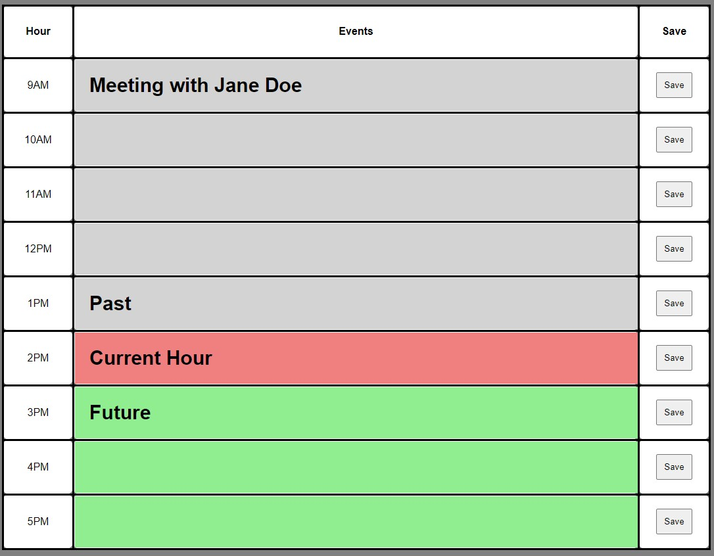

# Daily Planner

Upon launch, you will find a daily planner ready to be filled with events for standard business hours. This is what you will be presented with after loading.

There will be rows with 3 different colors depending on what time it is currently where you are.  Any rows that are grey, are time zones that have already passed. There will be one row that is red, which is the current hour.  Finally, the rows that are green are times that are in the future. You may click on any middle row and edit its context to add important events which should occur in your day during business hours. To save your events, be sure to click the save button to the right of each row you would like to save.

Here is an example of some boxes filled out along with the color coded time stamps if I were to load the page at 2:15 PM

